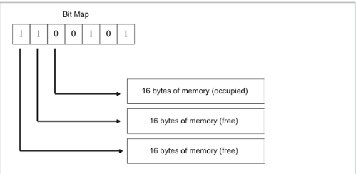

## Memory Management - Bitmap Allocation

- Involves an array of bits which keeps tracks of Memory is free or allocated.
- Each Memory is broken down into various blocks and each bit in the bitmap represents
  one of these blocks.

### Image example



### Usage examples

```
#include "mem_manage.h"
#define BLOCK 4096


int main()
{
    MemoryManager* mmptr = new MemoryManager(BLOCK);
    void* ptr = mmptr->allocate(sizeof(int));
    mmptr->release(ptr);
    delete mmptr;
    return 0;
}
```
